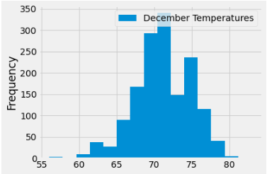

# SurfsUp Challenge 

## Overview

This analysis has been conducted to determine the temperature trends for the months of June and December in Oahu, Hawaii. This analysis will be used to determine the likelihood of success of operating a surf and ice cream shop in the area all year around rather than it being only a seasonal business. 

## Results

### June Summary Statistics for Temperature Trends

### December Summary Statistics for Temperature Trends

### Key Takeaways
- The average temperature in June was 75°F, while in December it was approx. 71°F. 
- The minimum temperature in June was 64°F, and in December it was 56°F.
- The maximum temperature in June was  84°F, and in December it was 83°F.

## Summary 

Summary: Provide a high-level summary of the results and two additional queries that you would perform to gather more weather data for June and December.

Given the recorded temperature trends for June and December which were represented in the above **Results** section, it is evident that there is a greater range of temperatures in December, with the minimum reaching 56°F, in comparison to June's lowest temperature recorded which was 64°F. The highest temperatures recorded for both months were very close in range, 83°F in December and 84°F in June. 

Even though the temperature drop is lower in December than in June, it is wise to review the frequency of each temperature recorded. In order for the surf and ice cream shop to be a success all year around and not only in the summer, the weather needs to be warm all year around, especially focusing on December which tends to be the coldest month. The following temperatures ranges are the most frequent given the data, in the following order:
- 70-72°F 
- 68-70°F
- 74-76°F

Given the temperature trends for both June and December, it is recommended to open a Surf and Ice Cream Shop in Oahu, Hawaii. This analysis suggests that there is a strong likelihood of success of the business all year round. 

Something else to consider however, is also the location in Oahu. To find the optimal location, an additional query has been conducted to show the different stations fiven for 
